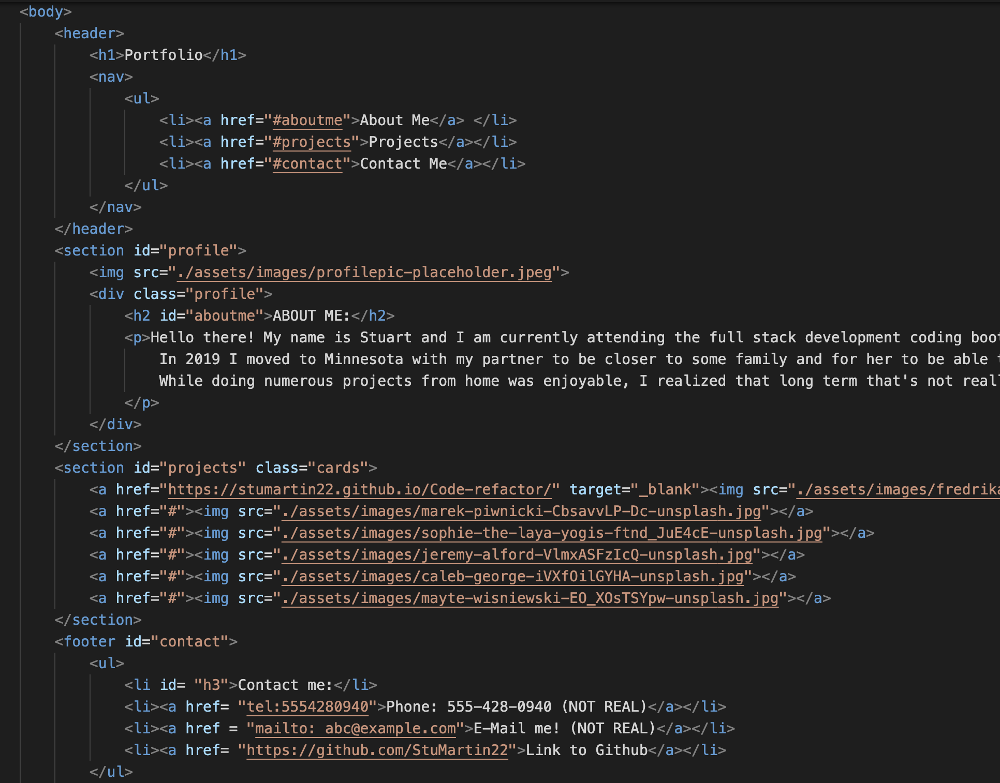

<h1 align="center" id="top"> Portfolio </h1>
  <h1 align="center"></h1>
  
  ---
  
  <h1 align="center" id="about">About This Application</h1>
  
  A personal portfolio created using React.js

  <h1 align="center" id="license">License Type</h1>

  
   
  https://opensource.org/licenses/MIT
   
  Copyright 2022 Stuart Martin 

    Permission is hereby granted, free of charge, to any person obtaining a copy of this software and associated documentation files (the "Software"), to deal in the Software without restriction, including without limitation the rights to use, copy, modify, merge, publish, distribute, sublicense, and/or sell copies of the Software, and to permit persons to whom the Software is furnished to do so, subject to the following conditions:
    
    The above copyright notice and this permission notice shall be included in all copies or substantial portions of the Software.
    
    THE SOFTWARE IS PROVIDED "AS IS", WITHOUT WARRANTY OF ANY KIND, EXPRESS OR IMPLIED, INCLUDING BUT NOT LIMITED TO THE WARRANTIES OF MERCHANTABILITY, FITNESS FOR A PARTICULAR PURPOSE AND NONINFRINGEMENT. IN NO EVENT SHALL THE AUTHORS OR COPYRIGHT HOLDERS BE LIABLE FOR ANY CLAIM, DAMAGES OR OTHER LIABILITY, WHETHER IN AN ACTION OF CONTRACT, TORT OR OTHERWISE, ARISING FROM, OUT OF OR IN CONNECTION WITH THE SOFTWARE OR THE USE OR OTHER DEALINGS IN THE SOFTWARE.
  
  ---
  
  <h1 align="center"><a href="#top">Table of Contents</a></h1>
  <h2 align="center"><a href="#about">About</a></h2>
  <h2 align="center"><a href="#technologies">Technologies Used</a></h2>
  <h2 align="center"><a href="#images">Images and Videos</a></h2>
  <h2 align="center"><a href="#installation">Installation</a></h2>
  <h2 align="center"><a href="#usage">Usage</a></h2>
  <h2 align="center"><a href="#contributing">Contributing</a></h2>
  <h2 align="center"><a href="#tests">Tests</a></h2>
  <h2 align="center"><a href="#license">License</a></h2>
  <h2 align="center"><a href="#current">Links</a></h2>
  <h2 align="center"><a href="#questions">Questions?</a></h2>
  
  ---
  
  <h1 align="center" id="technologies">Technologies Used</h1>
  
   

   

  
  
  ---
  
  <h1 align="center" id="images">Images and Videos</h1>
  <h2 align='center'> This is an image of hardcoded html from my first attempt at a portfolio a couple of weeks into my bootcamp program. </h2>

  
  
  <h2 align='center'> This is an image of the current header / main page of portfolio. </h2>

   

<h2 align='center'> This image is of the footer / main page of portfolio </h2>

  
  
  ---
  
  <h1 align="center" id="installation">Installation</h1>
  
  n/a hosted web app
  
  ---
  
  <h1 align="center" id="usage">Usage</h1>
  
  See what I'm about! See what I do. See how to get a hold of me!
  
  ---
  
  <h1 align="center" id="contributions">Contributions</h1>
  
  Contributions are not currently accepted as this is a self created and self sustaining product. Alternatively if you would like to use the content herewithin check the licensure attached.
  
  ---
  
  <h1 align="center"id="current">Current Production State</h1>
  
  
<a href="https://stumartin22.github.io/Portfolio/">Live Link Here</a>

  
  <h1 align="center">Repository for Project</h1>
  
  
<a href="https://github.com/StuMartin22/Portfolio">View Repo Here</a>

  
  ---
  
  <h1 align="center" id="questions">Questions? Contact Me!</h1>
  
  
Stuart Martin

  
stucodes22@gmail.com

  
<a href="https://github.com/StuMartin22" >GitHub Link</a>
